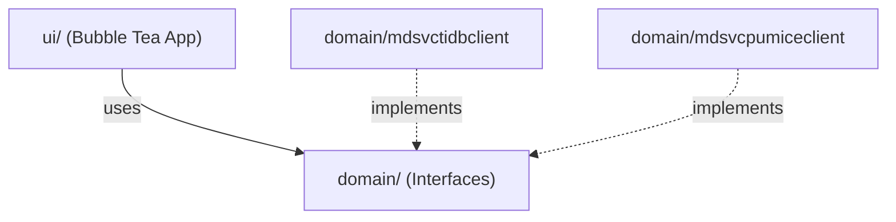
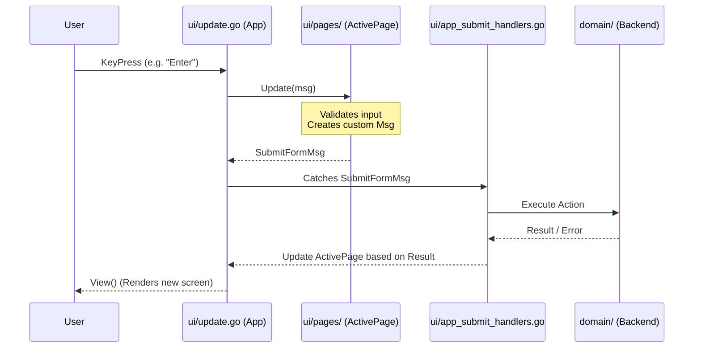

# niova-ctl Architecture Guide

This document outlines the architectural patterns used in the `niova-ctl` application. Following a major refactor, the application shifted from a monolithic script to a highly modular structure based on **The Elm Architecture (TEA)** using the `charmbracelet/bubbletea` framework.

## 1. Architectural Overview

The application is strictly separated into two primary concerns:
1. **Domain (`domain/`)**: Handles backend business logic and abstracts away the physical storage backend.
2. **User Interface (`ui/`)**: Handles the presentation layer and state machine via Bubble Tea.

By decoupling these concerns, `niova-ctl` can interact identically with both `mdsvc-tidb` and native `niova-mdsvc` (raft/gossip) backends without modifying UI code.

---

## 2. Directory Structure

### `domain/` (Backend Abstraction)
* Provides interface definitions (e.g., `ControlPlaneClient`, `UserServiceClient`) that the UI uses to fetch/mutate data.
* Contains sub-packages (`mdsvctidbclient/`, `mdsvcpumiceclient/`) that implement these interfaces for their respective backends.
* **Rule:** UI components should *never* import the specific client implementations directly. They should only rely on the interfaces defined in the root of `domain/`. The one legitimate exception is construction — something has to build the concrete client once, somewhere: `ui/app.go`'s `NewApp` (eager, for the initial `CPClient`/`UserServiceClient`) and `ui/session.go`'s `EnsureUserClient` (lazy, for niova-mdsvc's user client, built on first use rather than at startup) both import `domain/mdsvcpumiceclient`/`domain/mdsvctidbclient` directly for exactly this. No other file in `ui/` does, or should.

### `ui/` (The Bubble Tea Orchestrator)
* `app.go`: Defines the root `App` orchestrator. It manages global state (network clients, current active tab, status/loading state) and routes keystrokes to the active page. Control-plane data is refreshed on demand (initial load, Ctrl+R, or after a save/delete succeeds) — there is no periodic background polling.
* `update.go` / `navigation.go`: Handles global keyboard shortcuts, tab switching, and transitioning between pages.
* `app_submit_handlers.go`: Catches custom messages (e.g., `SubmitFormMsg`) emitted by individual pages to execute network requests via the `domain` clients.

### `ui/pages/` (View Controllers)
* Every distinct screen (a form, a table, a detail view) implements the `Page` interface defined in `page.go`.
* A `Page` encapsulates its own internal state, its own `Update` logic, and its own `View` rendering.
* **Rule:** Pages are intentionally isolated. They do not have access to global variables. If a page needs data to render, it must be passed in via its constructor (e.g., `NewDevicePage(device)`).

### `ui/components/` (Reusable Elements)
* Contains reusable UI primitives like `Table`, `Form`, and `ConfirmDialog`.
* Pages construct and embed these components to avoid duplicating rendering logic.

---

## 3. Data Flow (The TEA Pattern)

When a user presses a key, the data flows as follows:

1. **Input**: User presses a key.
2. **App Update (`ui/update.go`)**: The root `App` catches the key. If it's a global shortcut (like switching tabs), the `App` handles it. Otherwise, it passes the keystroke down to the `ActivePage`.
3. **Page Update (`ui/pages/`)**: The page processes the keystroke. If the user submits a form, the page returns a custom `tea.Msg` (e.g., `SubmitPartitionDiskFormMsg`).
4. **Action Handling (`ui/app_submit_handlers.go`)**: The `App` catches this custom message, triggers a `domain` client method (e.g., `CreateMultipleEqualPartitions`), and then changes the `ActivePage` based on the result.

---

## 4. How to Add a New Feature

Adding a new feature (like a new screen) requires a few boilerplate steps to ensure state encapsulation. Do not add global variables to `App` for a single screen's state.

1. **Create the Page**: Create a new file in `ui/pages/` (e.g., `my_feature.go`).
2. **Define the Struct**: Define a struct that implements the `Page` interface (`Init`, `Update`, `View`, `Title`, `KeyBindings`).
3. **Trigger the Route**: In `ui/navigation.go` or `ui/update.go`, listen for the key command and swap the active page: `a.ActivePage = pages.NewMyFeaturePage()`.
4. **Handle Output (Optional)**: If your page submits data, define a custom `tea.Msg` struct in your page file. Catch that message in `ui/app_submit_handlers.go` to perform the API call.
