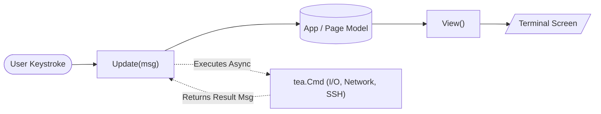
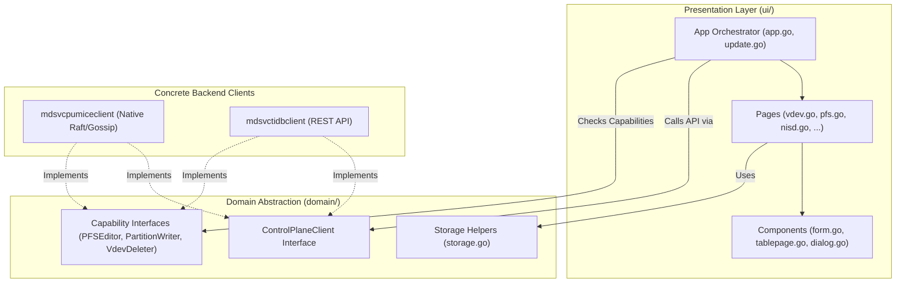
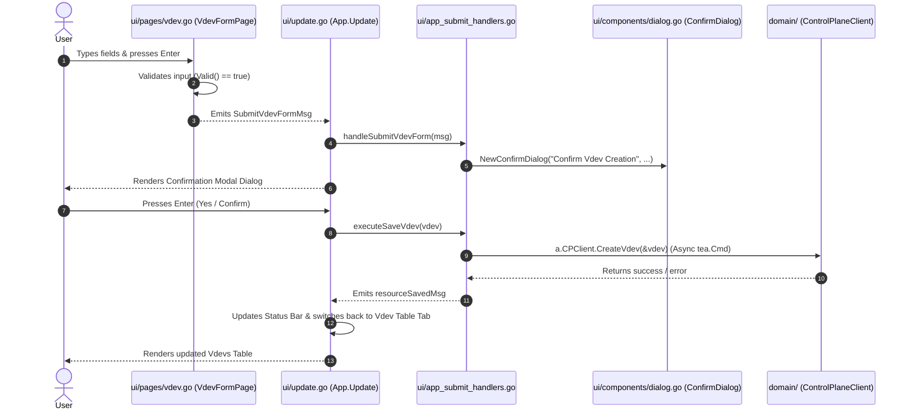
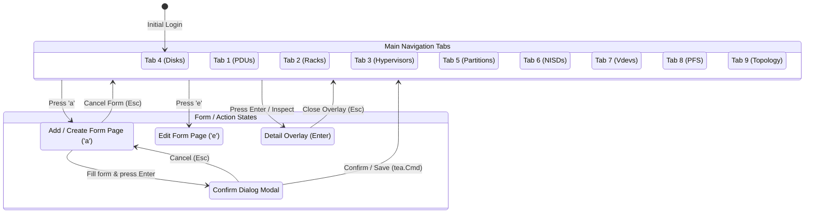

# Beginner's Guide to TUI Development in `niova-ctl`

Welcome! If you have never worked with **Terminal User Interfaces (TUIs)** or the Go **Bubble Tea** framework, this document will guide you through the directory structure, architecture, and step-by-step development patterns in `niova-ctl`.

---

## 1. Core Concepts: TUI vs Web/Desktop Development

In traditional web development, user interfaces are built with HTML/CSS/DOM trees, and event handlers modify elements in place. 

In a **Bubble Tea TUI**, the interface is built using **The Elm Architecture (TEA)**. The entire terminal screen is re-rendered as a plain string on every state change:



### Key Terminology
1. **Model**: A Go `struct` holding the current application or page state (e.g., input values, selected tab, focus index).
2. **Update**: A function `Update(msg tea.Msg) (Model, tea.Cmd)` that receives events (keypresses, network responses) and updates the Model.
3. **View**: A function `View() string` that turns the Model's data into a styled string rendered to the terminal screen.
4. **Cmd (Command)**: An asynchronous operation (e.g., an HTTP REST call, SSH command, or timer) that returns a `tea.Msg` when done.
5. **Lipgloss**: A CSS-like styling library used to apply colors, padding, borders, and margins to terminal text strings.

---

## 2. Architecture & Layer Decoupling

The `niova-ctl` application is strictly decoupled into two primary layers: **`domain/`** (Backend Business Logic) and **`ui/`** (TUI Presentation Layer).



### Directory Tree Map

```
niova-ctl/
├── main.go                       # Application entry point (CLI flags, app startup)
├── ARCHITECTURE.md               # High-level architectural specification
├── DEVELOPER_GUIDE.md            # This beginner-friendly TUI development guide
│
├── domain/                       # BACKEND ABSTRACTION LAYER (No UI code here)
│   ├── backend.go                # Central interfaces: ControlPlaneClient, UserServiceClient
│   ├── storage.go                # Storage helpers (ParseSizeToBytes, FormatBytesToHuman)
│   ├── types.go                  # Domain data types and type aliases
│   │
│   ├── mdsvcpumiceclient/        # Native niova-mdsvc backend client (Raft/Gossip)
│   │   ├── controlplane.go       # Implements ControlPlaneClient for niova-mdsvc
│   │   └── user.go               # Implements UserServiceClient
│   │
│   └── mdsvctidbclient/          # mdsvc-tidb backend client (HTTP REST API)
│       ├── client.go             # HTTP client base configuration
│       ├── vdev.go               # REST implementation for Vdev operations
│       ├── pfs.go                # REST implementation for PFS operations
│       └── ...
│
└── ui/                           # PRESENTATION LAYER (Bubble Tea TUI)
    ├── app.go                    # Root App model (Active tab, page routing, status bar)
    ├── update.go                 # Root message dispatcher & global keyboard shortcuts
    ├── navigation.go             # Tab navigation & page transition triggers
    ├── app_submit_handlers.go    # Bridges UI form events to domain client actions
    ├── view.go                   # Root layout compositor (Header + ActivePage + Footer)
    │
    ├── components/               # Reusable TUI Widgets
    │   ├── form.go               # Form widget (Text inputs & Select dropdown pickers)
    │   ├── dialog.go             # Confirmation & Warning modal dialogs
    │   ├── tablepage.go          # Interactive data tables (sort, search, inspect overlay)
    │   ├── header.go / footer.go # Top ASCII banner & bottom shortcut key guides
    │   └── commandbar.go         # Command line bar for quick `:command` actions
    │
    ├── pages/                    # Individual Screen Controllers
    │   ├── page.go               # Page interface definition
    │   ├── vdev.go               # Virtual Device Pool table view & creation form page
    │   ├── pfs.go                # Parallel File System table view & form page
    │   ├── nisd.go               # NISD storage daemon management page
    │   ├── device.go             # Physical Disk management page
    │   └── ...
    │
    └── styles/                   # Lipgloss Color Schemes & Visual Theme
        └── styles.go             # Global colors, card borders, and text highlight styles
```

---

## 3. How a Form Screen Works (Step-by-Step Walkthrough)

Let's trace how the **Vdev Pool Creation Form** ([`ui/pages/vdev.go`](niova-mdsvc/controlplane/niova-ctl/ui/pages/vdev.go)) operates end-to-end:



### Step 1: Defining the Page Struct and Fields
A form page wraps `components.FormModel`:

```go
type VdevFormPage struct {
	Form   components.FormModel
	IsEdit bool
}

func NewVdevFormPage(isEdit bool, initial domain.VdevConfig, pfsList []domain.PFS) *VdevFormPage {
	fields := []components.FieldDefinition{
		{Type: components.FieldTypeText, Label: "Vdev Pool Name", Value: initial.Name},
		{Type: components.FieldTypeText, Label: "Pool Size", Placeholder: "e.g. 500GB or 1TB"},
		{Type: components.FieldTypeSelect, Label: "Redundancy Mode", Options: redundancyOpts},
		{Type: components.FieldTypeSelect, Label: "Parallel File System (PFS)", Options: pfsOpts},
	}
	return &VdevFormPage{Form: components.NewForm(fields), IsEdit: isEdit}
}
```

### Step 2: Handling Keypresses in `Update()`
When the user presses `Enter` on the last field, the page emits a custom message (`SubmitVdevFormMsg`):

```go
func (p *VdevFormPage) Update(msg tea.Msg) (Page, tea.Cmd) {
	if keyMsg, ok := msg.(tea.KeyMsg); ok {
		if keyMsg.String() == "enter" && p.Form.FocusedIndex == len(p.Form.Inputs)-1 && p.Form.Valid() {
			return p, func() tea.Msg {
				return SubmitVdevFormMsg{
					Name: p.Form.Value(0),
					SizeGB: p.Form.Value(1),
					PFS: p.Form.Value(6),
				}
			}
		}
	}
	cmd := p.Form.Update(msg)
	return p, cmd
}
```

### Step 3: Catching the Message in `app_submit_handlers.go`
The root application ([`ui/update.go`](niova-mdsvc/controlplane/niova-ctl/ui/update.go)) receives `SubmitVdevFormMsg` and passes it to `handleSubmitVdevForm`:

```go
func (a *App) handleSubmitVdevForm(msg pages.SubmitVdevFormMsg) (tea.Model, tea.Cmd) {
	sizeBytes := domain.ParseSizeToBytes(msg.SizeGB)
	vdev := domain.VdevConfig{Name: msg.Name, Size: sizeBytes, PFSID: msg.PFS}
	
	// Show Confirmation Modal Dialog
	a.ConfirmDialog = components.NewConfirmDialog(
		"Confirm Vdev Creation",
		fmt.Sprintf("Create Vdev Pool %q?", vdev.Name),
		details,
		components.ConfirmTypeWarning,
		"save_vdev",
		vdev,
	)
	return a, nil
}
```

### Step 4: Executing the API Action
When the user confirms the dialog, `executeSaveVdev` calls `a.CPClient.CreateVdev(&vdev)` through the unified `domain.ControlPlaneClient` backend interface asynchronously.

---

## 4. Navigation & Page Lifecycle

The application routes between table views, form pages, and modal overlays using a clean state transition model:



---

## 5. How to Add a New Form Field

To add a new input or dropdown field to an existing form (e.g., adding a field to `VdevFormPage`):

1. **Update `SubmitXFormMsg` Struct**:
   In `ui/pages/<resource>.go`, add the new field to the message payload struct.

2. **Add to `FieldDefinition` List**:
   In `New<Resource>FormPage`, append a new `FieldDefinition`:
   - Use `FieldTypeText` for typed input.
   - Use `FieldTypeSelect` for dropdown pickers.

3. **Read Value in `Update()`**:
   Read `p.Form.Value(index)` at the corresponding field index and pass it into the message constructor.

4. **Process in `app_submit_handlers.go`**:
   Map the new field to your backend domain model struct.

---

## 6. Development & Testing Commands

### Build Locally
```bash
go build ./controlplane/niova-ctl
```

### Build and Test
When updating the binary on a remote test machine while `niova-ctl` is running:
```bash
# 1. SSH & Build with environment DIR path
ssh  "cd /<user>/niova-mdsvc && \
  DIR=/<user>/niova-cp-bin make DIR=/<user>/niova-cp-bin pmdbserver proxyserver niova-ctl"

# 2. Safely install to bin path (avoids 'Text file busy' error)
ssh  "install -m 755 /<user>/niova-mdsvc/libexec/niova-ctl \
  /<user>/niova-cp-bin/libexec/niova/niova-ctl"
```

---

## 7. Important TUI Rules & Gotchas

1. **Never Import Concrete Clients in UI Pages**:
   UI code should **only** import `domain` (the root package containing interfaces and types). Never import `domain/mdsvctidbclient` or `domain/mdsvcpumiceclient` inside `ui/pages/` or `ui/components/`.

2. **Form Vertical Spacing**:
   Forms must remain compact. Avoid extra double blank lines (`\n\n`) between form fields so that all elements remain visible on standard terminal height constraints (24–30 rows).

3. **Size Input Flexibility**:
   Always use `domain.ParseSizeToBytes(input)` to handle human-formatted sizes (e.g. `500`, `500GB`, `1TB`, `1.5T`).

4. **Never Modify Private DOM / Global App State in Pages**:
   Keep page state local to the page struct. Trigger transitions by returning Bubble Tea messages (`tea.Msg`).
