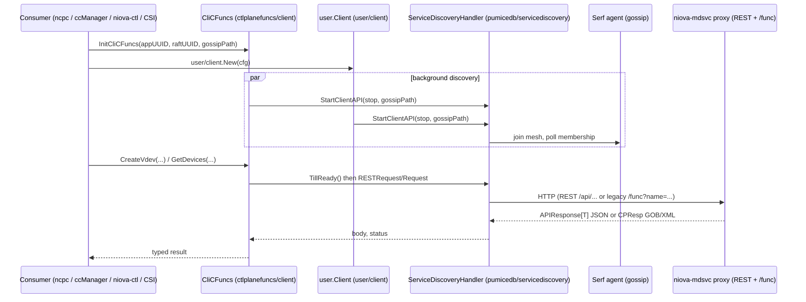
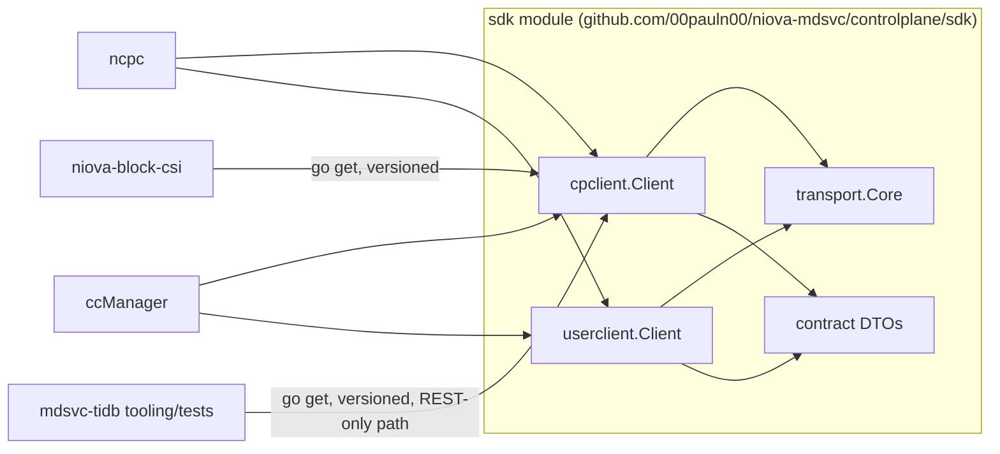

# Packaging the Control Plane Client — Design & Implementation Plan

**Status:** Proposal — direction recommended (Option 2 below), implementation not yet started.

**Scope:** `niova-mdsvc/controlplane/ctlplanefuncs/{client,lib}`, `niova-mdsvc/controlplane/user/{client,lib}`, `niova-mdsvc/controlplane/restapi`, and their consumers in `niova-mdsvc` and `mdsvc-tidb`.

---

## 1. Decision Summary

**Not a separate repository yet.** Split the client into its own Go module *inside* `niova-mdsvc`, collapse the two independently-reimplemented client cores (control-plane client and user/auth client) into one, and stop forcing REST-only consumers to carry cgo, Serf, and PumiceDB as hard dependencies. Move to a standalone repository later, once the module is small and both `niova-mdsvc` and `mdsvc-tidb` are actually depending on it.

This document expands the original proposal into a concrete architecture review, target design, API surface, phased migration, and test plan, all grounded in the code as it exists today (surveyed 2026-08-05).

---

## 2. Current Architecture Review

### 2.1 Package inventory

| Path | Module | LOC | Role |
|---|---|---|---|
| `controlplane/ctlplanefuncs/client` (`clictlplanefuncs.go`) | `niova-mdsvc` (root) | 1000 | Infra/vdev client (`CliCFuncs`): devices, NISDs, vdevs, PDUs, racks, hypervisors, PFS, snapshots, chunks |
| `controlplane/ctlplanefuncs/lib` | `niova-mdsvc` (root) | 880 | Shared domain types (`Device`, `Nisd`, `VdevConfig`, …), the legacy `/func` envelope (`CPReq`/`CPResp`), GOB registration |
| `controlplane/user/client` (`client.go`) | `niova-mdsvc` (root) | 356 | Auth/user client (`Client`): login, CRUD on users |
| `controlplane/user/lib` | `niova-mdsvc` (root) | — | User domain types (`UserReq`, `UserResp`, `LoginResp`) + encryption/keygen helpers |
| `controlplane/restapi` | `niova-mdsvc` (root) | 587 | Wire contract: `APIResponse[T]`, `ErrorResponse`, `Status`, every request/payload DTO, **and** server-side `WriteJSON`/`WriteData`/`WriteError` helpers |
| `modules/niova-pumicedb/go/pkg/utils/servicediscovery` | `niova-pumicedb/go` | 408 | Transport: Serf-based membership + `Request`/`RESTRequest` HTTP dispatch with failover |
| `modules/niova-pumicedb/go/pkg/pumicecommon` | `niova-pumicedb/go` | 248 | Grab-bag: `Encoder`/`Decoder` (pure Go, used by both clients) **and** cgo-only PMDB struct marshalling (`import "C"`, `C.GoBytes`) in the same package |
| `controlplane/containerConfigManager` (`ccManager.go`) | `niova-mdsvc` (root) | 182 | Consumer: generates NISD container configs |
| `controlplane/ncpc` (`ncpc.go`) | `niova-mdsvc` (root) | 1230 | Consumer: admin CLI, largest surface user of both clients |
| `controlplane/niova-ctl` | `niova-mdsvc` (root) | — | Consumer: interactive TUI admin tool (bubbletea) |
| `niova-block-csi` (external repo) | — | — | Consumer via git submodule on `niova-mdsvc` |
| `mdsvc-tidb` (external repo, module `mdsvc-api`) | — | — | **No Go dependency today** — reimplements a slice of the client by hand (§2.4) |

Everything in the first six rows lives inside the single `github.com/00pauln00/niova-mdsvc` Go module (root `go.mod`). Note the root `go.mod` already carries:

```
replace github.com/00pauln00/niova-mdsvc/controlplane => ./controlplane/
```

with no `go.mod` under `controlplane/` to satisfy it — this looks like a first step toward Option 2 that was never finished. Phase 1 below completes it.

### 2.2 Current call flow



Each consumer constructs **two** independent discovery-backed clients (`CliCFuncs` and `user.Client`) side by side — see `ccManager.go`, `ncpc.go`, `niova-ctl/main.go` — each spinning up its own `ServiceDiscoveryHandler` and background Serf goroutine.

### 2.3 Duplication inside `niova-mdsvc` itself

`clictlplanefuncs.go` and `user/client/client.go` are two independent, near-identical implementations of the same REST transport core. Side by side:

| Concern | `CliCFuncs` (`clictlplanefuncs.go`) | `user.Client` (`client.go`) |
|---|---|---|
| Discovery bootstrap | `InitCliCFuncs` — inits xlog, starts `StartClientAPI` goroutine | `New` — inits xlog, starts `StartClientAPI` goroutine (near-identical body) |
| Header building | `restHeaders(write bool)` | `restHeaders(token string, write bool)` |
| HTTP result → error | `restResult(body, status, err)` | `restResult(body, status, err)` (byte-for-byte identical) |
| Envelope decode | `decodeEnvelope[T](body)` | `decodeEnvelope[T](body)` (byte-for-byte identical) |
| Write idempotency key | `nextRncui()` on `atomic.Uint64` | `nextRncui()` on `atomic.AddUint64` (same scheme, different atomic API) |
| GET | `restGet(path)` | `restGet(token, path)` |
| POST/PUT | `restPost`/`restPut` | `restWrite(method, token, path, body)` |

This is duplicated logic *within a single module*, not just across repos — the clearest, lowest-risk target for the "common client core" the refactor should produce. Today a bug fix (e.g. to `decodeEnvelope`'s error handling) has to be made twice and can silently drift, since nothing enforces the two stay identical.

### 2.4 Duplication with `mdsvc-tidb`

`mdsvc-tidb` cannot import `niova-mdsvc` Go code today (no module boundary, and even if there were, it would pull in Serf + cgo for a service that only needs REST). The effect is visible in three places:

1. **Hand-rolled REST client.** [`mdsvc-tidb/tests/ccmanager/main.go`](../../mdsvc-tidb/tests/ccmanager/main.go) defines its own `envelope` struct, `doJSON`, and `login` — a smaller, parallel reimplementation of exactly what `restResult`/`decodeEnvelope` already do in `niova-mdsvc`. This test also cannot exercise `ccManager` as Go code; it builds the `niova-mdsvc` binary externally and shells out to it (`-ccmanager /path/to/binary`), so there is no automated CI coverage of ccManager-against-mdsvc-tidb (the workflow file has no step that builds or fetches it).
2. **Independently maintained DTOs.** [`mdsvc-tidb/internal/models/dto/responses.go`](../../mdsvc-tidb/internal/models/dto/responses.go) defines its own `Response[T]` envelope and per-resource structs (`NisdArgs`, `GetVdevResp`, …) by hand, with comments like *"Field names match the niova-mdsvc REST contract (restapi.NisdArgs)"* — i.e. the contract is kept in sync by convention and code review, not by the compiler.
3. **Two OpenAPI specs.** `niova-mdsvc/openapi.yml` and `mdsvc-tidb/cmd/server/openapi.yaml` independently describe what is meant to be the same REST API.

None of this is `mdsvc-tidb`'s fault — `CliCFuncs` already targets both backends over REST (see its `restWriteResource` comment: *"PUT /api/resource?type=rtype (the TiDB-style infra upsert)"*), so the client is largely backend-agnostic already. What's missing is a way for `mdsvc-tidb` to *depend* on it instead of re-deriving it.

### 2.5 Dependency graph and the cgo boundary

```mermaid
graph TD
    subgraph Consumers
        ncpc[ncpc / niova-ctl / ccManager]
        csi[niova-block-csi]
    end
    subgraph "niova-mdsvc (root module)"
        CCF[ctlplanefuncs/client]
        UCX[user/client]
        LIB[ctlplanefuncs/lib]
        ULIB[user/lib]
        REST[restapi DTOs + server helpers]
    end
    subgraph "niova-pumicedb/go module"
        SD[servicediscovery]
        PC[pumicecommon]
    end
    subgraph external deps
        SERF[hashicorp/serf, memberlist, mdns]
        CC[C toolchain / cgo]
    end

    ncpc --> CCF
    ncpc --> UCX
    csi -.git submodule.-> CCF
    CCF --> LIB
    CCF --> REST
    CCF --> SD
    UCX --> REST
    UCX --> ULIB
    UCX --> SD
    LIB --> PC
    CCF --> PC
    SD --> SERF
    PC -->|"Decode() at pumicecommon.go:208, import \"C\" at :26"| CC

    style CC fill:#f66,stroke:#900
    style PC fill:#fbb,stroke:#900
```

The cgo dependency is real but narrow: `pumicecommon.go` has a single `import "C"` at the top of the file and one function, `Decode`, that calls `C.GoBytes` (line 208) to marshal data across the PMDB C boundary. The functions the REST client actually uses — `Encoder`/`Decoder` (JSON/XML/GOB, lines 67–95) — are pure Go. But Go compiles a package as one unit: because `Decode` and `Encoder`/`Decoder` sit in the same package, *any* importer of `pumicecommon`, including a pure-REST client, needs `CGO_ENABLED=1` and a working C toolchain just to build. This is root cause #2 below, now pinned to an exact line.

### 2.6 Current problems (confirmed against code)

1. **No module boundary.** `ctlplanefuncs/{client,lib}` and `user/{client,lib}` belong to the root `niova-mdsvc` module, so any external consumer (CSI, a future `mdsvc-tidb` dependency) inherits the entire dependency graph — PumiceDB, the TUI stack (bubbletea/lipgloss), everything — for what should be a small REST SDK.
2. **Heavy/leaky dependencies.**
   - Serf-based service discovery is mandatory even when a consumer already knows the control-plane URL (CSI's case, per the original proposal).
   - `pumicecommon`'s single cgo file forces `CGO_ENABLED=1` on all importers (§2.5).
3. **Backend-specific APIs still present.** Most operations already go over REST, but ten methods still use the legacy `/func` envelope tied to the PumiceDB backend: `GetDevices`, `GetNisds`, `GetVdevsWithChunkInfo`, `GetPDUs`, `GetRacks`, `GetHypervisor`, `GetVdevConfigs`, `GetNisdListWithAvailSize`, `GetChunk`, `GetChunks` (all in `clictlplanefuncs.go`). These cannot work against `mdsvc-tidb` at all today.
4. **Duplicated transport core within the same module** (§2.3) — `CliCFuncs` and `user.Client` reimplement the same REST envelope handling independently.
5. **Duplicated wire contract across repos** (§2.4) — `mdsvc-tidb` hand-maintains DTOs and an envelope type that must track `restapi`'s shape by convention.

---

## 3. Refactoring Goals

1. Produce one common client core (transport + envelope + auth + retry) instead of two independently maintained copies.
2. Give the client a real module boundary so consumers pull only what they need.
3. Make discovery optional: support both a Serf-discovered proxy set and a static base-URL, selectable at construction time.
4. Make the wire-contract package (`restapi` DTOs) importable standalone, without pulling in the niova-mdsvc proxy's server-side handler code.
5. Finish migrating the remaining `/func`-only reads to REST so the client is backend-agnostic in practice, not just in the common cases.
6. Keep `mdsvc-tidb` and `niova-mdsvc` provably on the same wire contract (shared Go types), instead of hand-synced DTOs and two OpenAPI files.
7. Do all of this without breaking `ncpc`, `ccManager`, `niova-ctl`, or CSI mid-migration.

---

## 4. Options Considered

| Option | Verdict |
|---|---|
| 1 — Keep everything as-is | Works today, does not scale: consumers pull the whole mdsvc dependency graph, CSI needs git submodules, `mdsvc-tidb` cannot reuse the client, internal packages leak into the public surface. |
| **2 — Nested Go module inside this repo (recommended)** | Smaller dependency graph, clear public API boundary, atomic development stays possible, cheap to extract into its own repo later. Cost: nested modules need independent version tags and CI needs to check both the local `replace` build and the standalone module build. |
| 3 — Separate SDK repository now | Clean dependency model and versioning, but every DTO/API change becomes a cross-repo change immediately, and it doesn't fix the backend-specific-API or dependency-weight problems on its own — it just relocates them. Good long-term destination, wrong first step. |
| 4 — Separate `ccManager` repo | `ccManager` is a thin wrapper over the client; splitting it adds release overhead without addressing the actual duplication. Not recommended. |
| 5 — Generate clients from OpenAPI | Useful for contract validation (and worth doing regardless, to kill the two independently-maintained `openapi.yml`/`openapi.yaml`), but generated clients don't include service discovery, auth helpers, or the domain-shaped return types `ncpc`/`ccManager`/CSI already depend on. Not a replacement for the SDK. |

**Recommendation stands: Option 2.** The rest of this document is the implementation plan for it.

---

## 5. Proposed Target Architecture

### 5.1 Target module layout

Grounded in the packages that exist today — this is a regrouping and a new module boundary, not a from-scratch redesign:

```
controlplane/
    go.mod                          <- NEW: module github.com/00pauln00/niova-mdsvc/controlplane
                                        (root go.mod's replace directive already expects this path)
    sdk/
        contract/                   <- from restapi: APIResponse[T], ErrorResponse, Status, DTOs only
                                        (WriteJSON/WriteData/WriteError STAY server-side, see 5.5)
        transport/                  <- NEW: the de-duplicated REST core
            core.go                    (restHeaders, restResult, decodeEnvelope[T], nextRncui,
                                         retry loop — replaces the copy in each of CliCFuncs/user.Client)
            discovery.go                Serf-backed transport (wraps servicediscovery, optional)
            staticurl.go                NEW: base-URL transport (no Serf/no gossip config)
        cpclient/                   <- from ctlplanefuncs/client + ctlplanefuncs/lib (types only)
        userclient/                 <- from user/client + user/lib
    ctlplanefuncs/
        server/                     <- UNCHANGED: stays in the root module (PumiceDB-coupled)
    user/
        server/                     <- UNCHANGED: stays in the root module
    proxy/                          <- UNCHANGED: stays in the root module, imports sdk/contract for DTOs
    containerConfigManager/         <- updated import path only (sdk/cpclient, sdk/userclient)
    ncpc/                           <- updated import path only
    niova-ctl/                      <- updated import path only
```

Server-side code (`ctlplanefuncs/server`, `user/server`, `proxy`) is **not** moved. It stays PumiceDB-coupled by nature and remains in the root module. Only the client-facing surface moves.

### 5.2 Responsibilities per package

| Package | Owns | Does not own |
|---|---|---|
| `sdk/contract` | Wire types: `APIResponse[T]`, `ErrorResponse`, `Status` + its HTTP mapping, every request/payload DTO | Server-side `WriteJSON`/`WriteData`/`WriteError` (those stay in `restapi`, imported only by `proxy`) |
| `sdk/transport` | Header construction, HTTP status → Go error mapping, envelope decode, write-idempotency key generation, retry/failover, the discovery-vs-static-URL choice | Domain types, business logic, knowledge of "vdev" vs "user" endpoints |
| `sdk/cpclient` | Infra/vdev domain methods (`CreateVdev`, `GetDevices`, …) built on `sdk/transport` | Transport internals |
| `sdk/userclient` | Auth/user domain methods (`Login`, `CreateUser`, …) built on `sdk/transport` | Transport internals |

### 5.3 Public API boundary

Only `sdk/contract`, `sdk/transport`, `sdk/cpclient`, `sdk/userclient` are public. Everything else in `controlplane/` (server, proxy) is an implementation detail consumers should not import — enforced structurally by which module a package lives in, not just by convention.

### 5.4 How consumers use it after the refactor



`cpclient.Client` and `userclient.Client` both hold a `*transport.Core` instead of each rolling their own `restHeaders`/`restResult`/`decodeEnvelope`/`nextRncui`. A fix to retry behavior or envelope decoding is made once.

### 5.5 Ownership boundaries

- **`sdk/*` is client-owned**: changes ship independent of proxy internals, reviewed for backward compatibility with existing consumers (ncpc, ccManager, niova-ctl, CSI, and eventually mdsvc-tidb).
- **`restapi` (trimmed to server helpers) / `proxy` / `*/server` stay proxy-owned**: free to change internal wiring as long as `sdk/contract` (the wire shape) doesn't change without a version bump.
- **`sdk/contract` is the seam**: any change here is a wire-contract change and should be treated like an API change (semver-relevant, changelog-worthy), because after Phase 4 `mdsvc-tidb`'s server handlers are validated against it too.

---

## 6. API Design

### 6.1 Client initialization

Two construction paths, both returning the same client type:

- `cpclient.NewWithDiscovery(cfg DiscoveryConfig) (*Client, func())` — today's behavior: Serf gossip discovery, `HTTPRetry`/`SerfRetry`, background membership goroutine, teardown func to stop it (the current `user/client.New` already returns a `tearDown func()`; `ctlplanefuncs/client.InitCliCFuncs` does not — this inconsistency should be fixed in Phase 1, not carried forward).
- `cpclient.NewWithBaseURL(cfg StaticConfig) (*Client, func())` — new: fixed base URL(s), no Serf, no gossip config file. This is what CSI (which already knows the control-plane URL, per §2 of the original proposal) and `mdsvc-tidb` tooling/tests should use.

Both are built on the same `transport.Core`, which is an interface (`Do(req)`) with two implementations (`discoveryTransport`, `staticTransport`) — the domain clients (`cpclient`, `userclient`) never know which one they're talking to.

### 6.2 Session/connection management

- Auth is a bearer JWT set post-construction via `SetToken(token string)`, as today. No change to this model — it works and both clients already do it.
- `transport.Core` should own the token instead of each domain client storing its own copy (`CliCFuncs.token` and whatever `user.Client` equivalent exists today) — one source of truth per logical session.
- Write idempotency (`X-RNCUI`, format `"<appUUID>:0:0:0:<seq>"`) stays a `transport.Core` responsibility (`nextRncui()`), generated once instead of twice.

### 6.3 Request/response abstraction

Keep the existing `APIResponse[T]{Status, Error, Payload}` envelope — it already generalizes across both backends (see `restWriteResource`'s TiDB-shape comment). Consolidate the two copies of `decodeEnvelope[T]` into one, in `transport`, parameterized so `cpclient` and `userclient` both call `transport.Decode[T](body)`.

The legacy `/func` (`CPReq`/`CPResp`, GOB/XML) envelope is **not** part of the new `sdk/contract` package — it is PumiceDB-only and does not survive past Phase 3 (§7). It stays in `ctlplanefuncs/lib` in the root module until the last `/func` caller is migrated, then deleted.

### 6.4 Error handling model

- Transport-level failures (connection refused, timeout, DNS) → Go `error`, triggers retry/failover in `transport.Core`.
- Non-2xx HTTP with a decodable `ErrorResponse` body → Go `error` carrying the server's message (`restResult`'s current behavior — keep it).
- 2xx HTTP with `Status != StatusOK` in the envelope (the "method error" pattern used by non-user endpoints) → Go `error` (`decodeEnvelope`'s current behavior — keep it).
- Callers get a single `error` either way; they should not need to distinguish transport failures from method failures unless they want to (future: consider a typed error wrapping `restapi.Status` so callers *can* branch on `StatusNotFound` vs `StatusConflict` etc. without string matching — `Status` already has the right granularity, it's just not surfaced as a typed Go error today).

### 6.5 Retry and timeout handling

Current behavior (`ServiceDiscoveryHandler.RESTRequest`, `servicediscovery.go:153`): up to `HTTPRetry` attempts, each against a freshly-picked server, 1-second sleep between attempts, only transport errors trigger a retry (a non-2xx HTTP response is treated as a valid answer and returned immediately, not retried). This is reasonable and should carry over unchanged into `transport.discoveryTransport`.

Gaps to close during the refactor, not before (avoid scope creep in Phase 1):
- No overall request timeout/context support today — `RESTRequest` has no `context.Context` parameter. Adding one is in scope for Phase 2 since it's needed for the static-URL transport anyway (a plain `net/http` client needs a timeout to bound calls when the proxy is unreachable, since there's no Serf failover to fall back on).
- `staticTransport` needs its own retry policy (bounded retries against the same URL, since there's no server list to fail over across) — simpler than the discovery case but should share the same `Core` interface.

### 6.6 Logging and tracing

Keep `xlog` (`github.com/00pauln00/niova-lookout/pkg/xlog`) as-is; it's already the shared logger across both clients. No new tracing framework is in scope for this refactor — flag it as a possible future addition (a `context.Context`-carried request ID would pair naturally with the timeout work in §6.5) but don't couple it to this migration.

### 6.7 Thread safety

- `writeSeq` stays an `atomic.Uint64` (the `CliCFuncs` style; prefer it over `user.Client`'s `atomic.AddUint64(&c.writeSeq, ...)` — same semantics, more idiomatic Go).
- The Serf membership table's locking (`agentTableLock`, `serfUpdateLock`, `statUpdateLock` in `ServiceDiscoveryHandler`) is unchanged — `discoveryTransport` wraps it, doesn't reimplement it.
- `transport.Core`'s token field needs a mutex or `atomic.Pointer[string]` once it's shared by both `cpclient` and `userclient` instances that might call `SetToken` concurrently with in-flight requests — today each client's token is set once at startup in practice, but the shared-core design should not assume that.

---

## 7. Migration Plan

Each phase is independently shippable and keeps existing consumers building throughout — no phase requires a flag day.

### Phase 0 — Module skeleton (no behavior change)

- Add `controlplane/go.mod` (module `github.com/00pauln00/niova-mdsvc/controlplane`), matching the `replace` directive already sitting unused in the root `go.mod`.
- No package moves yet. Root module keeps building against `./controlplane` via the existing `replace`.
- **Validation:** `go build ./...` and `go test ./...` at the root are unaffected; `go build ./...` inside `controlplane/` succeeds standalone.

### Phase 1 — Extract the common transport core, de-duplicate

- **Files affected:** new `controlplane/sdk/transport/core.go` (consolidates `restHeaders`, `restResult`, `decodeEnvelope[T]`, `nextRncui` from both `clictlplanefuncs.go` and `user/client/client.go`); `clictlplanefuncs.go` and `client.go` are trimmed to call into it instead of each keeping a private copy.
- Move `ctlplanefuncs/client` → `sdk/cpclient`, `ctlplanefuncs/lib` (domain types only, not the `/func` envelope) → `sdk/cpclient` or a shared types subpackage, `user/client` → `sdk/userclient`, `user/lib` → `sdk/userclient`.
- Split `restapi` into `sdk/contract` (DTOs + `APIResponse[T]`/`ErrorResponse`/`Status`) and a trimmed `restapi` (server-only `WriteJSON`/`WriteData`/`WriteError`) that `proxy` imports; `proxy` also imports `sdk/contract` for the DTOs it already shares with the client.
- **Compatibility:** update import paths in `ccManager.go`, `ncpc.go`, `niova-ctl/main.go`, `proxy/*.go`, `ctlplanefuncs/server/*.go`. Keep method signatures unchanged so this is a pure import-path + internal-plumbing change from the consumer's point of view.
- **Validation:** existing unit tests (`clictlplanefuncs_test.go`, `restclient_test.go`, `restuser_test.go`, `user_authentication_test.go`, `vdev_test.go`, `distribution_report_client_test.go`, `client_test.go` in `user/client`) must pass unmodified except for import paths. Add a new test asserting `cpclient` and `userclient` share the same `transport.Core` type (guards against the duplication creeping back).

### Phase 2 — Reduce coupling

- Extract the cgo-free half of `pumicecommon` (`Encoder`, `Decoder`, `Format`, `GossipInfo`) into a new pure-Go package (e.g. `pumicecommon/wire`), leaving `Decode`/`Encode`/`GetStructSize` (the `C.GoBytes`-based, PMDB-C-boundary functions) in the original cgo-tainted package. `sdk/transport` depends only on the new pure-Go package — `CGO_ENABLED=0` builds become possible for SDK consumers.
- Add `staticTransport` (base-URL mode, §6.1/6.5) alongside the existing Serf-backed `discoveryTransport`; both implement the same `transport.Core` interface.
- Add `context.Context` plumbing to `RESTRequest`/the new transport (needed for `staticTransport`'s timeout, §6.5).
- **Validation:** new unit tests for `staticTransport` against an `httptest.Server`; confirm `go build -tags netgo` (or equivalent `CGO_ENABLED=0` check) succeeds for `sdk/...` in CI.

### Phase 3 — Finish the REST migration

- Convert the ten remaining `/func`-only reads (§2.6 item 3) to REST endpoints on the proxy + corresponding `sdk/cpclient` methods, following the pattern already established by `GetNisd`/`GetVdevConfig`/`GetPFS`.
- Once the last caller of `ctlplanefuncs/lib`'s `CPReq`/`CPResp`/`request`/`get`/`put` is gone, delete them and the GOB registration for the legacy envelope.
- **Validation:** parity tests — for each migrated method, assert identical results from the old `/func` path and new REST path before removing the old path (short-lived, throwaway comparison tests during the migration window only).

### Phase 4 — `mdsvc-tidb` adopts the SDK

- Tag `controlplane/sdk` (e.g. `controlplane/sdk/v0.1.0`) so it's `go get`-able as a versioned nested module.
- `mdsvc-tidb` adds it as a dependency; rewrite `tests/ccmanager/main.go`'s hand-rolled `doJSON`/`login`/`envelope` to use `sdk/cpclient`/`sdk/userclient` directly (still against a locally-built server, but now exercising the real client instead of a shadow implementation).
- Evaluate replacing `mdsvc-tidb/internal/models/dto/responses.go`'s hand-maintained structs with `sdk/contract` types where the shapes are meant to be identical — this closes the "kept in sync by comment" gap from §2.4. (This is the one step in this plan that touches `mdsvc-tidb` code; scope and sequence it with that team since it's a cross-repo change.)
- **Validation:** `mdsvc-tidb`'s `tests/ccmanager` integration test runs against the SDK-based client in CI (closing the current gap where it's not automated at all, §2.4).

### Phase 5 — Standalone repository (future, not scheduled)

- Only once: `sdk/` has no PumiceDB/Serf-mandatory dependency for the static-URL path, multiple projects (niova-block-csi, mdsvc-tidb, ncpc/ccManager/niova-ctl) are actively consuming it, and `sdk/contract` has been stable for at least one release cycle. At that point extraction is a mechanical `git subtree`/history-preserving move, not a design change.

---

## 8. Testing Strategy

### 8.1 Unit tests (existing, to preserve through the move)

Already present and should keep passing (moved, not rewritten, in Phase 1): `clictlplanefuncs_test.go`, `restclient_test.go`, `restuser_test.go`, `user_authentication_test.go`, `vdev_test.go`, `distribution_report_client_test.go` (ctlplanefuncs/client); `client_test.go` (user/client); `user_test.go`, `encryption_test.go`, `keygen_test.go` (user/lib).

### 8.2 New unit tests introduced by this refactor

- `transport.Core` tests independent of any domain client: header construction, retry/failover against a fake server list, envelope decode error paths (malformed JSON, non-zero `Status`, non-2xx with/without a decodable `ErrorResponse` body).
- `staticTransport` tests against `httptest.Server` (Phase 2): timeout behavior, bounded retry, no-Serf-required.
- A structural test that `cpclient.Client` and `userclient.Client` both compose `transport.Core` rather than reimplementing it (cheap regression guard for the exact duplication this refactor removes).
- `CGO_ENABLED=0` build check for `sdk/...` in CI (Phase 2 onward).

### 8.3 Integration tests

- **Against `niova-mdsvc` (PumiceDB/proxy backend):** existing flows through `ncpc`/`ccManager` continue to exercise the SDK end-to-end; no new harness needed, just updated import paths.
- **Against `mdsvc-tidb` (TiDB backend):** promote `tests/ccmanager` (Phase 4) from "hand-rolled client + external binary" to "SDK-based client + `go test`", wired into `mdsvc-tidb`'s CI workflow so it actually runs automatically (it currently does not — no step builds or fetches the ccManager binary in `.github/workflows/mdsvc-tidb-tests-workflow.yml`).
- **Contract parity:** for any endpoint both backends implement, run the same `sdk/cpclient` test table against both a `niova-mdsvc` proxy instance and an `mdsvc-tidb` instance, asserting the SDK gets equivalent typed results from both. This is the direct test of goal #6 (§3) and doubles as the safety net for Phase 3's `/func`-to-REST conversions.

### 8.4 Regression strategy

- Phase 1 and Phase 2 are refactors of internals behind unchanged method signatures — the existing test suites in §8.1, run unmodified (module path aside), are the regression gate.
- Phase 3 uses the parity-test approach (§ Phase 3 validation) specifically because it changes wire behavior (new REST endpoints replacing `/func` calls) and needs before/after comparison, not just "tests still pass."

### 8.5 Failure scenarios to validate explicitly

- All discovered proxies down / unreachable → `discoveryTransport` exhausts `HTTPRetry` and returns a clear error (already covered by `pickServer`'s "Server not available" path — add a test asserting the error surfaces through `cpclient`/`userclient`, not just the transport).
- Static URL unreachable (Phase 2) → bounded retry, then a timeout error, not a hang (no `context.Context` today means this is currently untested and possibly unbounded for a hypothetical static mode — must be validated once `staticTransport` exists).
- Expired/invalid JWT → server returns `StatusUnauthorized`/`StatusForbidden`; confirm `decodeEnvelope` surfaces this as a distinguishable error, not a generic failure.
- Serf agent present but zero members advertising the expected `Type` tag → `TillReady` retry path (already exists; add explicit coverage).
- `mdsvc-tidb` and `niova-mdsvc` returning structurally different data for the same `sdk/contract` type (contract drift) → caught by the Phase 4 parity tests, not at runtime.

---

## 9. Risks and Mitigation

| Risk | Mitigation |
|---|---|
| Import-path churn breaks `ncpc`/`ccManager`/`niova-ctl`/CSI builds | Phase 1 changes only import paths and internal plumbing, not method signatures; CSI (submodule consumer) gets a heads-up before the module boundary lands since its submodule pin will need bumping. |
| Nested Go module versioning adds process overhead (tagging `controlplane/sdk/vX.Y.Z` separately from root) | Document the tagging convention alongside this plan before Phase 1 merges; CI should verify both the root `replace`-based build and a standalone `go build` of `sdk/` on every change. |
| `/func`-to-REST conversions (Phase 3) change server behavior, not just client internals | Parity tests (§8.3/§ Phase 3) compare old vs. new path before the old path is deleted; convert one method at a time, not as a single large change. |
| Splitting `pumicecommon` (Phase 2) breaks a server-side (cgo) caller that assumed `Encoder`/`Decoder` and `Decode`/`Encode` live in one package | Grep all importers of `pumicecommon` before splitting (`ctlplanefuncs/server`, `pumiceserver`, `pumicestore`, `pumiceclient`, `nisdMonitor`, `niova-lookout/monitor` all touch cgo `C.GoBytes` elsewhere in the same module family — confirm none of them import the pure-Go functions from a path that would break). |
| `mdsvc-tidb` adoption (Phase 4) is a cross-repo change outside this plan's direct control | Scope Phase 4 as a proposal to that team with a concrete, small first step (replace `tests/ccmanager/main.go`'s hand-rolled client only) rather than a wholesale DTO migration in the same change. |
| Backward compatibility for external consumers (CSI) once `sdk` is versioned | Semver the `sdk` module; treat `sdk/contract` changes as the highest-scrutiny changes in the whole plan (§5.5) since both a Go client and, post-Phase-4, a second server implementation depend on its shape. |

---

## 10. Rollout Strategy / Summary

The current problems — a single oversized Go module, a cgo dependency hiding behind two pure-Go functions, backend-specific `/func` calls, and (found during this review) a fully duplicated transport core plus independently-maintained wire types across repos — are all addressed incrementally, in the order in Section 7, with no phase requiring consumers to change in lockstep.

Rollout order: Phase 0 and 1 land together (module skeleton is pointless without something in it) behind unchanged public method signatures; Phase 2 and 3 are internal hardening, each independently testable via the parity/contract tests in Section 8; Phase 4 is the payoff — `mdsvc-tidb` gets a real dependency instead of a shadow implementation — and is explicitly sequenced last because it is the only phase touching a repository this plan doesn't own. Phase 5 (standalone repo) is deliberately left unscheduled until Phase 4 proves the module is lightweight and backend-agnostic in practice, not just in design.
